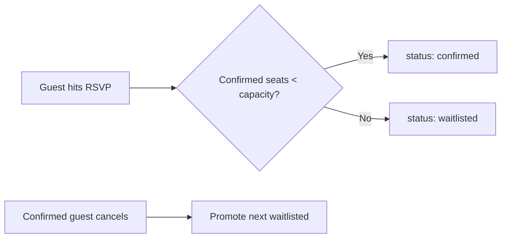

# Events

Events are scheduled programmes: game nights, tournaments, workshops, socials, family events, and one-off specials.

## Event types

Defined in `VALID_EVENT_TYPES`:

| Type           | Typical use                                          |
| -------------- | ---------------------------------------------------- |
| `Game Night`   | Themed evenings (Co-op night, Strategy night)        |
| `Tournament`   | Bracketed competitive play, prize support            |
| `Workshop`     | Teaching sessions for new players                    |
| `Social`       | Open social mixers, often for new attendees          |
| `Family Event` | Daytime, kid-friendly, lighter games                 |
| `Special`      | Anything else (book launches, designer visits, etc.) |

## Capacity & RSVPs

Each event has a `capacity` (nullable for uncapped events). RSVPs are tracked separately in the `rsvps` table with status `confirmed`, `cancelled` or `waitlisted`.

When a confirmed attendee cancels, the API automatically promotes the next waitlisted RSVP. This logic lives in `PATCH /api/events/:id/rsvps/:rsvpId`.

## Event lifecycle

Events have their own status union: `upcoming`, `ongoing`, `completed`, `cancelled`. These are set explicitly by staff — there's no automatic transition based on the clock. That's deliberate: an event that started 10 minutes late should still be `upcoming` until staff say otherwise.

## Sold-out signal

The dashboard's alerts panel surfaces events where `confirmed_rsvps >= capacity`. The seed includes one such event so the alert is visible on a fresh install.

## See also

- [API · Events](../reference/api#events)
- [Guide · Run a tournament](../guides/run-a-tournament)
