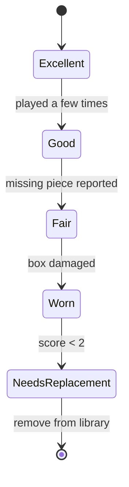

# Games

A **game** is a physical title on a shelf, not an abstract IP. If your café owns three copies of *Wingspan*, that's **one game row** with `copies_total = 3`.

## Anatomy of a game row

| Field                   | Type    | Purpose                                                  |
| ----------------------- | ------- | -------------------------------------------------------- |
| `title`                 | string  | Display name                                             |
| `min_players` / `max_players` | int | For filtering by party size                          |
| `play_time_minutes`     | int     | Help staff recommend a game that fits the time left      |
| `complexity`            | float   | BGG-style 1.0–5.0 weight                                 |
| `category`              | string  | One of `GAME_CATEGORIES`                                 |
| `copies_total`          | int     | Physical copies owned                                    |
| `copies_available`      | int     | Copies currently on the shelf (not checked out)          |
| `condition`             | enum    | `Excellent`, `Good`, `Fair`, `Worn`, `Needs Replacement` |
| `condition_score`       | int     | 1–5, derived from `condition`                            |
| `shelf_location`        | string  | Physical locator, e.g. `A3`                              |
| `last_inspected_at`     | ISO ts  | When staff last checked the components                   |
| `replacement_threshold` | int     | Months until a replacement review is due                 |
| `needs_replacement`     | 0/1     | Computed flag — drives the dashboard alert               |

## The condition lifecycle

Every checkout is an opportunity to **re-rate** the condition. When staff return a game, they pick a new condition label, which:

1. Updates `games.condition` and `games.condition_score`.
2. Updates `last_inspected_at` to now.
3. Sets `needs_replacement = 1` if the score falls below the configured floor (see [`game-utils.ts`](https://github.com/TabletopFoundry/cafemeeple/blob/main/lib/game-utils.ts)).



## Counting copies correctly

`copies_available` is **decremented** when a game is checked out and **incremented** on return. The check-out API rejects a request if `copies_available <= 0`, so concurrent staff can't both lend the last copy.

```ts
// app/api/checkout/route.ts (simplified)
const game = db.prepare('SELECT copies_available FROM games WHERE id = ?').get(game_id);
if (!game || game.copies_available <= 0) {
  return Response.json({error: 'No copies available'}, {status: 409});
}
```

## What "popular" actually means

The dashboard's "popular games" list isn't tracked in a counter column — it's recomputed from `game_checkouts` joined with sessions. That makes it trivially correct: there is no possibility of drift between the displayed count and the underlying truth.

```sql
SELECT g.id, g.title, COUNT(*) AS checkout_count
FROM game_checkouts c
JOIN games g ON g.id = c.game_id
JOIN sessions s ON s.id = c.session_id
WHERE s.started_at >= datetime('now', '-30 days')
GROUP BY g.id
ORDER BY checkout_count DESC
LIMIT 10;
```

## See also

- [API · Games](../reference/api#games)
- [Guide · Flag games for replacement](../guides/flag-replacements)
- [Guide · Check out a game](../guides/checkout-a-game)
