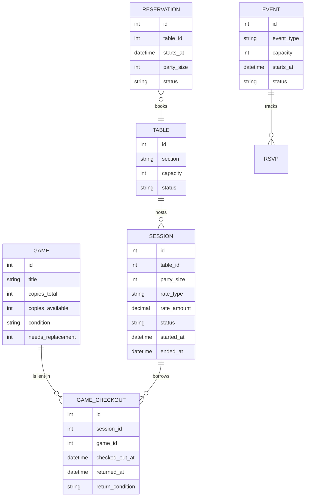
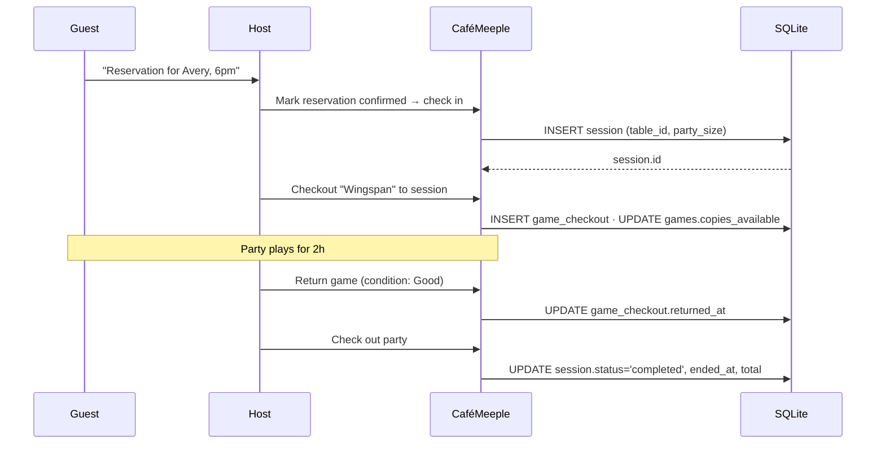

# Mental model

CaféMeeple revolves around four nouns. Once you've internalised how they relate, every screen in the app — and every endpoint in the API — falls into place.

## The four nouns

### 1. Games

A **game** is a physical title on a shelf. Each game has a number of copies (`copies_total`), a number of those currently borrowable (`copies_available`), and a condition rating from `Excellent` down to `Needs Replacement`. The library is the catalogue; checkouts are the verb.

→ [Games concept page](./games)

### 2. Tables

A **table** is a physical seat in the café, grouped by section (Main Floor, Patio, Quiet Corner, …). Tables have a capacity, a shape (for the floor plan render), and a current status (`available`, `occupied`, `reserved`, `maintenance`).

→ [Tables & sessions](./tables-and-sessions)

### 3. Sessions

A **session** represents a party seated at a table. It tracks when they arrived, how many people, and how the cover charge is billed (`per_person` or `per_table`). A session is `active` while they're seated and `completed` when they leave. The bill is computed from `rate_amount × duration × party_size_or_one`.

→ [Cover charges](./cover-charges)

### 4. Reservations & Events

A **reservation** is a future promise to seat a party at a specific table at a specific time. An **event** is a scheduled programme (game night, tournament, workshop) with capacity and RSVPs. They are independent of sessions — but a confirmed reservation typically becomes a session when the party arrives.

→ [Reservations](./reservations) · [Events](./events)

## How it flows on a Saturday night

## Design principles

- **One canonical source per fact.** The session row is the source of truth for "is this table occupied right now?" — no derived flags duplicated in the tables table.
- **Status transitions are explicit.** Reservations, sessions and events all have named status union types (see [`lib/constants.ts`](https://github.com/TabletopFoundry/cafemeeple/blob/main/lib/constants.ts)). UI never invents new statuses.
- **Soft deletes are avoided.** Cancelled reservations and no-shows stay in the database with terminal status; they show up in reports.
- **Conditions are scored.** Every game condition label has a 1–5 numeric score; the dashboard's "needs replacement" alert is just a SQL `WHERE` clause.

Continue with the per-entity deep dives:

- [Games](./games)
- [Tables & sessions](./tables-and-sessions)
- [Cover charges](./cover-charges)
- [Reservations](./reservations)
- [Events](./events)
