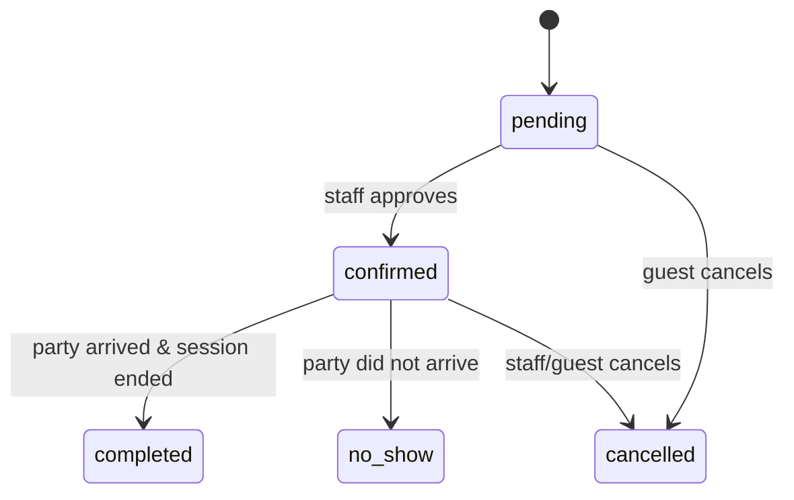

# Reservations

Reservations are promises about the future: "Avery, party of 4, table 12, Saturday at 7pm."

## States and transitions

Five statuses, defined in `VALID_RESERVATION_STATUSES`:

- **pending** — created via guest channel, awaits confirmation
- **confirmed** — staff approved
- **completed** — terminal; the linked session has ended
- **cancelled** — terminal
- **no-show** — terminal; the party never arrived after a confirmed reservation

## Fields

| Field          | Notes                                                          |
| -------------- | -------------------------------------------------------------- |
| `guest_name`   | Required                                                       |
| `party_size`   | Validated against the assigned table's `capacity`              |
| `table_id`     | Optional — unassigned reservations are allowed until confirmed |
| `starts_at`    | ISO 8601 timestamp                                             |
| `duration_min` | Default 120 (configurable)                                     |
| `phone`, `email`, `notes` | Optional contact + free-form                          |

## Capacity enforcement

The API rejects a reservation where `party_size > table.capacity` with HTTP `422 Unprocessable Entity`. The dashboard's alerts panel surfaces same-day reservations that no longer fit (e.g., a table was downgraded to maintenance).

## Calendar vs list

Both views in `/admin/reservations` hit the same endpoint: `GET /api/reservations?from=...&to=...`. The calendar groups by day; the list flattens. There is no separate "calendar API".

## See also

- [API · Reservations](../reference/api#reservations)
- [Tables & sessions](./tables-and-sessions)
