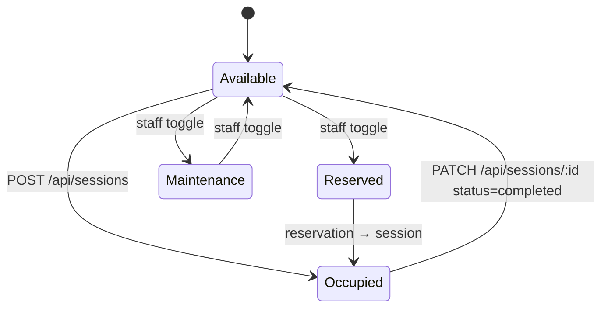

# Tables & sessions

**Tables** are physical. **Sessions** are temporal. A session is what happens at a table between check-in and check-out.

## Tables

A table row describes a seat in the café:

| Field        | Notes                                                                   |
| ------------ | ----------------------------------------------------------------------- |
| `name`       | Display label (e.g. `T-04`, `Window 2`)                                 |
| `section`    | One of `TABLE_SECTIONS` — drives the floor-plan grouping                |
| `capacity`   | Max party size                                                          |
| `shape`      | `rectangle`, `circle`, `square` — for floor-plan rendering              |
| `status`     | `available`, `occupied`, `reserved`, `maintenance`                      |

`status` is **derived intent**, not session state: when you start a session at a table, the table's status becomes `occupied`. When the session ends, it goes back to `available`. Maintenance and reserved are explicit overrides set by staff.

## Sessions

A session row tracks who is sitting where and how to bill them:

| Field          | Notes                                                              |
| -------------- | ------------------------------------------------------------------ |
| `table_id`     | Which table                                                        |
| `party_size`   | How many people                                                    |
| `rate_type`    | `per_person` or `per_table`                                        |
| `rate_amount`  | Currency amount applied per `rate_type`                            |
| `guest_name`   | Optional — helps staff recognise the party                         |
| `started_at`   | Auto-set on creation                                               |
| `ended_at`     | Set on check-out; null while active                                |
| `total_amount` | Computed on check-out                                              |
| `status`       | `active` or `completed`                                            |

## The check-in / check-out lifecycle

## Bill computation

Cover charges accumulate live in the UI but are persisted only at check-out. See the dedicated [Cover charges page](./cover-charges) for the formula and edge cases (rounding, minimum charges, partial hours).

## Concurrency

Starting a session on an occupied table fails with HTTP `409 Conflict`. The API does the existence check and the insert in the same `better-sqlite3` transaction, so two hosts clicking "check in" simultaneously cannot both succeed.

## Active sessions in the API

`GET /api/sessions?status=active` returns only sessions with `ended_at IS NULL`. The Tables screen uses this to render running totals next to each occupied table.

## See also

- [API · Sessions](../reference/api#sessions)
- [Guide · Check in a party](../guides/check-in-a-party)
- [Cover charges](./cover-charges)
