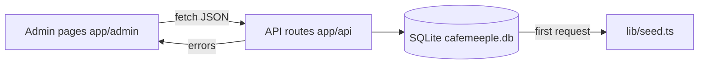

# A five-minute tour

With the dev server running ([installation](./installation)), open [http://localhost:3000/admin](http://localhost:3000/admin) and follow along. Every screen below is loaded with seeded data so the workflow is realistic.

## 1. Dashboard — `/admin`

The first thing you see. Five things to notice:

- **Top stat row** — today's revenue, active sessions, reservations on the books, upcoming events.
- **Revenue chart** — 30-day rolling chart powered by Recharts, fed by `/api/dashboard`.
- **Popular games** — leaderboard derived from `game_checkouts` joined with sessions.
- **Alerts** — replacement candidates, capacity issues, no-shows pending follow-up.
- **Quick actions** — jump to "start a session" or "create reservation" without navigating menus.

## 2. Games — `/admin/games`

The library. 171 seeded titles spanning every category in `GAME_CATEGORIES`. Search by title, filter by category, condition or shelf location.

Click any row to **edit metadata**, **log an inspection**, or **mark for replacement**. The condition score (1–5) drives the colour badge and feeds the replacement alert on the dashboard.

## 3. Tables — `/admin/tables`

A visual floor plan grouped by section (Main Floor, Quiet Corner, Window Seats, Patio, …). Each table card shows:

- Current status (`available`, `occupied`, `reserved`, `maintenance`).
- If occupied: party name, elapsed time, running cover-charge total.
- One-click **check-in** (start a session) or **check-out** (close the session, settle the bill).

This is the screen the host runs all night.

## 4. Checkout — `/admin/checkout`

Lend a game to a table. Pick a session, search the library, click checkout. When the party returns the game, log its post-play condition — the system writes a `game_checkouts` row and decrements `copies_available` automatically.

## 5. Reservations — `/admin/reservations`

Calendar view and list view share the same data. Status transitions are explicit:

`pending → confirmed → completed`

…with `cancelled` and `no-show` as terminal states. Same-day reservations are highlighted; reservations for tables that are already in maintenance are blocked.

## 6. Events — `/admin/events`

Tournaments, game nights, workshops, family events and one-off specials. Capacity caps automatically waitlist once full. RSVPs are managed inline.

## What's running under the hood

Every screen is a `"use client"` orchestrator that fetches from the REST API and renders shared UI primitives from `components/ui.tsx`. No GraphQL, no tRPC, no state-management library — just `fetch` and React hooks.

## Next

- [Customise the seed data](../guides/customize-seed-data) to match your real café.
- [Read the core concepts](../concepts/overview) to understand how sessions, checkouts and cover charges fit together.
