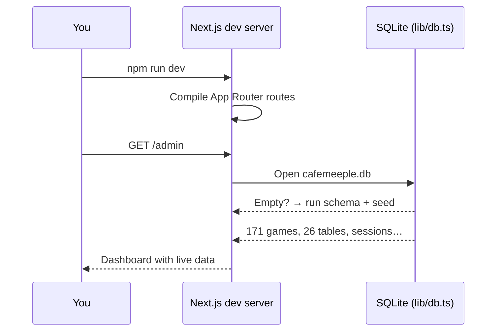

# Installation

Get CaféMeeple running on your machine in under five minutes.

## Prerequisites

| Tool   | Version              | Why                                          |
| ------ | -------------------- | -------------------------------------------- |
| Node.js | **18+** (20 LTS recommended) | Next.js 16 / React 19 baseline           |
| npm    | **9+**               | Workspace + lockfile features used by the repo |
| Git    | any                  | To clone the repository                      |

The repository pins a Node version in `.nvmrc`. If you use [nvm](https://github.com/nvm-sh/nvm):

```bash
nvm use
```

No external database server, no Docker, no Redis. SQLite is created on first request.

## 1. Clone and install

```bash
git clone https://github.com/TabletopFoundry/cafemeeple.git
cd cafemeeple
npm install
```

## 2. Start the dev server

```bash
npm run dev
```

That's it. Open the two URLs that matter:

- **Marketing landing page** — [http://localhost:3000](http://localhost:3000)
- **Admin dashboard** — [http://localhost:3000/admin](http://localhost:3000/admin)

The first request creates `cafemeeple.db` in the project root and seeds it with realistic development data. Subsequent restarts reuse the same database.

## 3. Verify the install

Run the type check and lint to confirm your toolchain is happy:

```bash
npm run typecheck
npm run lint
```

A clean build proves nothing is wrong with your environment:

```bash
npm run build
```

## Environment variables

CaféMeeple needs **zero** environment variables for local development. A `.env.example` is included for future integrations (payment processors, email providers); copy it only if you plan to enable those.

```bash
cp .env.example .env.local
```

## What just happened?



## Next steps

- [Take the guided tour](./first-tour) of every screen.
- [Learn the seed data shape](./seed-data) so you can demo to staff.
- Skip to [Core Concepts](../concepts/overview) for the mental model.
