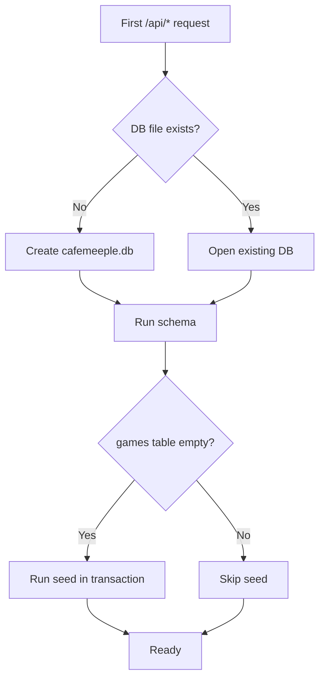

# Seed data

CaféMeeple ships with a **deterministic, idempotent** development seed. The same `git clone` produces the same data on every machine, which makes demos predictable and bug reports reproducible.

## What you get

| Entity       | Count | Notes                                                                                  |
| ------------ | ----: | -------------------------------------------------------------------------------------- |
| Games        |   171 | Every category in `GAME_CATEGORIES`. Realistic condition scores and inspection dates.   |
| Tables       |    26 | Distributed across all 8 named floor sections, plus shape variety.                     |
| Sessions     |    65 | 60 completed across the last 30 days, 5 currently active.                              |
| Reservations |    46 | Mix of confirmed, pending, completed, cancelled and no-show.                           |
| Events       |    18 | Game nights, tournaments, workshops, socials, family events, specials. One sold-out.   |
| Checkouts    |   126 | Heavy hitters, replacement candidates, never-checked-out titles.                       |

The seed deliberately includes **edge cases**: maintenance tables, full-capacity events, tables with zero historical sessions, and titles that have never left the shelf. They exist so screens that need to handle "no data" states are exercised by default.

## How it works

The seed lives in [`lib/seed.ts`](https://github.com/TabletopFoundry/cafemeeple/blob/main/lib/seed.ts). On the first API request after startup, [`lib/db.ts`](https://github.com/TabletopFoundry/cafemeeple/blob/main/lib/db.ts) opens (or creates) `cafemeeple.db`, runs the schema migrations, and — if the `games` table is empty — runs the seed inside a single transaction.



Because seeding is gated on emptiness, calling `POST /api/seed` is safe — it will **never** overwrite an existing database.

## Regenerating from scratch

When you want a clean slate (for example, after experimenting in dev):

```bash
rm -f cafemeeple.db cafemeeple.db-shm cafemeeple.db-wal
npm run dev
```

The next request rebuilds the database deterministically.

## Production safety

The seed module exports a `seedDatabase()` function that **refuses to run** when `NODE_ENV === 'production'`. The `/api/seed` route is gated behind the same check. Your production instance will not be auto-seeded — even if you point it at an empty database.

## Customising the seed

See the [Customise seed data guide](../guides/customize-seed-data) to replace the demo library with your real game inventory before going live.
