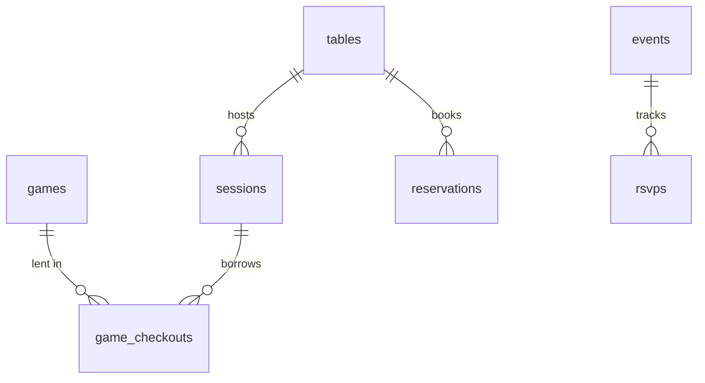

# Database schema

CaféMeeple uses SQLite via [`better-sqlite3`](https://github.com/WiseLibs/better-sqlite3). The schema lives in [`lib/db.ts`](https://github.com/TabletopFoundry/cafemeeple/blob/main/lib/db.ts) and is applied on first request. Each table is single-purpose; there are no shared catch-all tables.

## Entity diagram



## Tables

### `games`

| Column                   | Type     | Notes                                  |
| ------------------------ | -------- | -------------------------------------- |
| `id`                     | INTEGER PK |                                      |
| `title`                  | TEXT     | required                               |
| `min_players`            | INTEGER  |                                        |
| `max_players`            | INTEGER  |                                        |
| `play_time_minutes`      | INTEGER  |                                        |
| `complexity`             | REAL     | 1.0–5.0                                |
| `category`               | TEXT     | one of `GAME_CATEGORIES`               |
| `description`            | TEXT     |                                        |
| `image_url`              | TEXT     |                                        |
| `copies_total`           | INTEGER  |                                        |
| `copies_available`       | INTEGER  |                                        |
| `condition`              | TEXT     | one of `VALID_GAME_CONDITIONS`         |
| `condition_score`        | INTEGER  | 1–5, derived from `condition`          |
| `shelf_location`         | TEXT     |                                        |
| `last_inspected_at`      | TEXT     | ISO 8601                               |
| `replacement_threshold`  | INTEGER  | months                                 |
| `needs_replacement`      | INTEGER  | 0 or 1                                 |

### `tables`

| Column     | Type     | Notes                                |
| ---------- | -------- | ------------------------------------ |
| `id`       | INTEGER PK |                                    |
| `name`     | TEXT     |                                      |
| `section`  | TEXT     | one of `TABLE_SECTIONS`              |
| `capacity` | INTEGER  |                                      |
| `shape`    | TEXT     | one of `VALID_TABLE_SHAPES`          |
| `status`   | TEXT     | one of `VALID_TABLE_STATUSES`        |

### `sessions`

| Column         | Type     | Notes                                            |
| -------------- | -------- | ------------------------------------------------ |
| `id`           | INTEGER PK |                                                |
| `table_id`     | INTEGER FK → tables.id |                                  |
| `party_size`   | INTEGER  |                                                  |
| `rate_type`    | TEXT     | `per_person` or `per_table`                      |
| `rate_amount`  | REAL     |                                                  |
| `guest_name`   | TEXT     | optional                                         |
| `started_at`   | TEXT     | ISO 8601                                         |
| `ended_at`     | TEXT     | nullable                                         |
| `total_amount` | REAL     | nullable until check-out                         |
| `status`       | TEXT     | `active` or `completed`                          |

### `game_checkouts`

| Column             | Type       | Notes                                         |
| ------------------ | ---------- | --------------------------------------------- |
| `id`               | INTEGER PK |                                               |
| `session_id`       | INTEGER FK → sessions.id |                                 |
| `game_id`          | INTEGER FK → games.id    |                                 |
| `checked_out_at`   | TEXT       | ISO 8601                                      |
| `returned_at`      | TEXT       | nullable                                      |
| `return_condition` | TEXT       | nullable; one of `VALID_GAME_CONDITIONS`      |

### `reservations`

| Column         | Type       | Notes                                       |
| -------------- | ---------- | ------------------------------------------- |
| `id`           | INTEGER PK |                                             |
| `guest_name`   | TEXT       |                                             |
| `party_size`   | INTEGER    |                                             |
| `table_id`     | INTEGER FK | nullable until assigned                     |
| `starts_at`    | TEXT       | ISO 8601                                    |
| `duration_min` | INTEGER    | default 120                                 |
| `phone`        | TEXT       |                                             |
| `email`        | TEXT       |                                             |
| `notes`        | TEXT       |                                             |
| `status`       | TEXT       | one of `VALID_RESERVATION_STATUSES`         |

### `events`

| Column         | Type       | Notes                                       |
| -------------- | ---------- | ------------------------------------------- |
| `id`           | INTEGER PK |                                             |
| `name`         | TEXT       |                                             |
| `event_type`   | TEXT       | one of `VALID_EVENT_TYPES`                  |
| `description`  | TEXT       |                                             |
| `starts_at`    | TEXT       | ISO 8601                                    |
| `duration_min` | INTEGER    |                                             |
| `capacity`     | INTEGER    | nullable for uncapped                       |
| `status`       | TEXT       | one of `VALID_EVENT_STATUSES`               |

### `rsvps`

| Column        | Type       | Notes                                         |
| ------------- | ---------- | --------------------------------------------- |
| `id`          | INTEGER PK |                                               |
| `event_id`    | INTEGER FK → events.id |                                   |
| `guest_name`  | TEXT       |                                               |
| `party_size`  | INTEGER    | default 1                                     |
| `email`       | TEXT       |                                               |
| `status`      | TEXT       | `confirmed`, `cancelled`, `waitlisted`        |

## Querying directly

The SQLite file is at `cafemeeple.db` in the project root. Open it with any tool:

```bash
sqlite3 cafemeeple.db
sqlite> .tables
sqlite> SELECT title, copies_available FROM games WHERE needs_replacement = 1;
```

Or programmatically (read-only):

```ts
import Database from 'better-sqlite3';
const db = new Database('cafemeeple.db', {readonly: true});
const rows = db.prepare('SELECT * FROM tables WHERE status = ?').all('occupied');
```

## Migrations

The schema in `lib/db.ts` is intentionally simple. There is **no migration framework**. If you need to evolve the schema:

1. Add the `CREATE TABLE IF NOT EXISTS` or `ALTER TABLE` statement to `initSchema()`.
2. Bump a marker (e.g. `PRAGMA user_version`) if needed.
3. Document the change in the [Changelog](../changelog).

For production deployments where downtime matters, run the `ALTER TABLE` manually first against the live DB, then ship the code.
